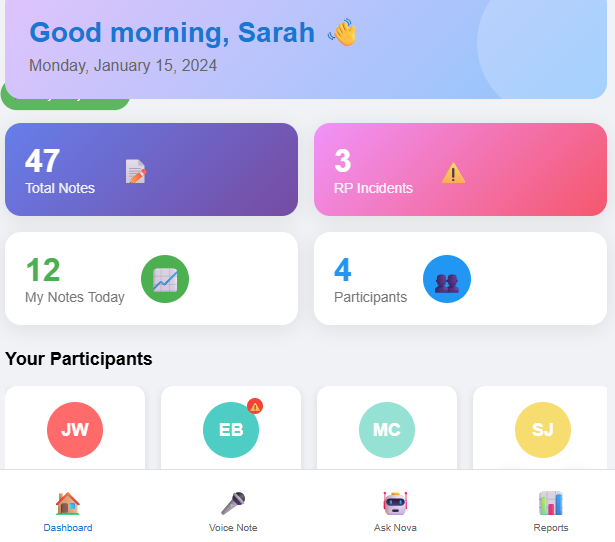
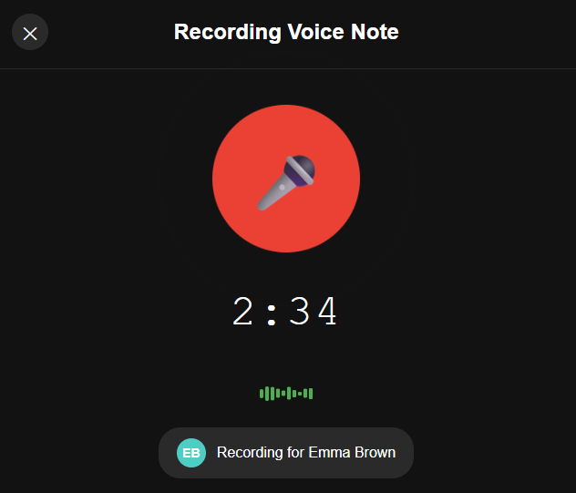
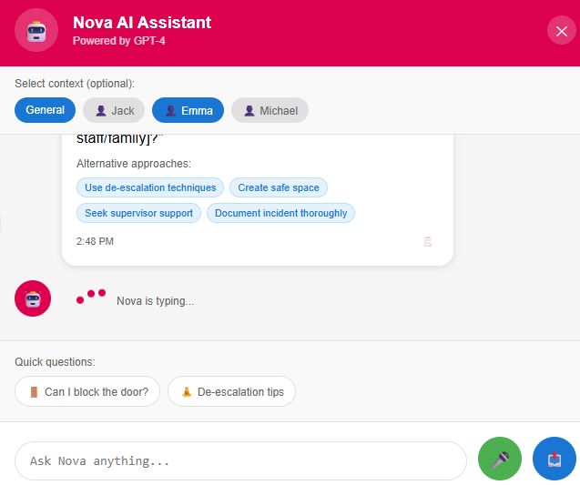

# 🏥 CareIQ - AI-Powered Support Worker Assistant

<div align="center">


[](https://reactjs.org/)
[](https://fastapi.tiangolo.com/)
[](https://firebase.google.com/)
[](https://openai.com/)
[](LICENSE)

**Voice-enabled progress notes with real-time AI coaching and restrictive practice detection**

[Features](#-features) • [Demo](#-demo) • [Installation](#-installation) • [Usage](#-usage) • [Architecture](#-architecture)

</div>

---

## 📋 Overview

CareIQ is a mobile-first, voice-enabled progress notes application designed for support workers in disability care settings. It uses cutting-edge AI to help workers document interactions, detect restrictive practices, and receive real-time coaching - all through natural voice commands.

### 🎯 Milestone 1 Objectives ✅

All deliverables for Milestone 1 have been successfully implemented:

- ✅ **Voice-to-Text Progress Note Logging** with Whisper integration
- ✅ **GPT-4 Restrictive Practice Detection** with visual alerts
- ✅ **"Ask Nova" AI Coaching Assistant** with voice and text input
- ✅ **Micro-Training Prompt Logic** for continuous learning
- ✅ **Firebase Authentication** with Google sign-in
- ✅ **Responsive React Frontend** with mobile-first design
- ✅ **FastAPI Backend** with comprehensive API endpoints
- ✅ **Complete Database Schema** with all required models

### 🌟 Bonus Features Implemented

Beyond the original requirements, we've added:

- 🎤 **"Hey Nova" Voice Activation** - Hands-free access to AI assistant
- 📱 **Progressive Web App** capabilities
- 📊 **Export Functionality** for reports
- 🔄 **Real-time Updates** and refreshing
- 🎨 **Modern UI/UX** with Material-UI

## ✨ Features

### 🎤 Voice-First Design
- **Voice Note Recording**: Speak your progress notes naturally
- **"Hey Nova" Activation**: Hands-free access to AI assistant
- **Voice Commands**: Ask questions using voice or text
- **Whisper Transcription**: Accurate speech-to-text conversion

### 🤖 AI-Powered Intelligence
- **GPT-4 Integration**: Advanced language understanding
- **Restrictive Practice Detection**: Automatic flagging of concerning behaviors
- **Smart Coaching**: Context-aware guidance and suggestions
- **De-escalation Tips**: Real-time alternatives to restrictive practices

### 📱 Mobile-Optimized Experience
- **Responsive Design**: Works perfectly on phones, tablets, and desktops
- **Touch-Friendly**: Large buttons and intuitive gestures
- **Offline Capable**: PWA support for basic functionality
- **Fast Performance**: Optimized for mobile networks

### 🔒 Security & Compliance
- **Firebase Authentication**: Secure login with Google
- **Role-Based Access**: Staff-only access control
- **Encrypted Storage**: Secure note storage
- **HIPAA Considerations**: Privacy-first design

## 🚀 Quick Start

### Prerequisites

- Python 3.8+ 
- Node.js 16+
- Firebase Project
- OpenAI API Key

### 🔧 Installation

1. **Clone the repository**
   ```bash
   git clone https://github.com/your-org/careiq.git
   cd careiq
   ```

2. **Backend Setup**
   ```bash
   cd backend
   python -m venv venv
   
   # Activate virtual environment
   # Windows:
   venv\Scripts\activate
   # Mac/Linux:
   source venv/bin/activate
   
   # Install dependencies
   pip install -r requirements.txt
   ```

3. **Frontend Setup**
   ```bash
   cd ../frontend
   npm install
   ```

4. **Environment Configuration**

   Backend `.env`:
   ```env
   DATABASE_URL=sqlite:///./careiq.db
   OPENAI_API_KEY=your-openai-api-key
   WHISPER_MODEL=base
   ```

   Frontend `.env`:
   ```env
   REACT_APP_FIREBASE_API_KEY=your-firebase-api-key
   REACT_APP_FIREBASE_AUTH_DOMAIN=your-auth-domain
   REACT_APP_FIREBASE_PROJECT_ID=your-project-id
   REACT_APP_FIREBASE_STORAGE_BUCKET=your-storage-bucket
   REACT_APP_FIREBASE_MESSAGING_SENDER_ID=your-sender-id
   REACT_APP_FIREBASE_APP_ID=your-app-id
   REACT_APP_API_URL=http://localhost:8000
   ```

5. **Firebase Admin Key**
   - Download your Firebase Admin SDK key from Firebase Console
   - Save as `backend/firebase_admin_key.json`

### 🏃‍♂️ Running the Application

1. **Start Backend**
   ```bash
   cd backend
   python app.py
   ```
   Backend will run on http://localhost:8000

2. **Start Frontend**
   ```bash
   cd frontend
   npm start
   ```
   Frontend will run on http://localhost:3000

### 👥 Sample Accounts

The application comes with pre-configured sample data:

**Demo Account:**
- Email: `demo@careiq.com`
- Password: `demo123`

**Sample Participants:**
- Jack Wilson
- Emma Brown
- Michael Chen
- Sarah Johnson

## 📖 Usage Guide

### 🎙️ Recording Voice Notes

1. Click the **Voice Note** button or FAB
2. Select a participant
3. Hold the microphone button to record
4. Release to stop and auto-transcribe
5. Review and submit

### 🤖 Using Nova AI Assistant

**Voice Activation:**
1. Enable "Hey Nova" by clicking the microphone chip
2. Say "Hey Nova" followed by your question
3. Nova will respond with guidance

**Manual Access:**
1. Click the Nova button
2. Type or speak your question
3. Get instant AI-powered coaching

### ⚠️ Restrictive Practice Alerts

When the system detects restrictive practices:
- **Red alert banner** appears immediately
- Note is **flagged** in the system
- **Alternative suggestions** are provided
- Incident is **tracked** for training purposes

### 📊 Micro-Training Prompts

The system monitors for:
- 2+ RP flags in 24 hours
- Multiple AI coaching queries
- Triggers personalized training suggestions

## 🏗️ Architecture

### Tech Stack

**Frontend:**
- React 18.2.0
- Material-UI 5.14
- Firebase Auth
- React Media Recorder
- Axios

**Backend:**
- FastAPI 0.104.1
- SQLAlchemy 2.0
- OpenAI Whisper
- GPT-4 API
- Firebase Admin SDK

### Database Schema

```sql
Users
├── id (UUID)
├── firebase_uid (String)
├── name (String)
├── email (String)
└── role (String)

Participants
├── id (UUID)
├── name (String)
└── created_at (DateTime)

Notes
├── id (UUID)
├── participant_id (FK)
├── user_id (FK)
├── text (Text)
├── timestamp (DateTime)
├── rp_flag (Boolean)
├── gpt_response (JSON)
└── audio_duration (Integer)

QueryLogs
├── id (UUID)
├── user_id (FK)
├── text (Text)
├── response (Text)
├── timestamp (DateTime)
└── intent_type (String)
```

### API Endpoints

```
POST   /api/voice-to-text     - Voice transcription & analysis
POST   /api/notes             - Create text note
GET    /api/notes             - Get notes (with filters)
POST   /api/ask-nova          - AI assistant query
GET    /api/participants      - List participants
GET    /api/stats             - Dashboard statistics
GET    /api/training-status   - Check training needs
POST   /api/auth/verify       - Verify Firebase token
```

## 🧪 Testing

### Mobile Testing on Desktop

1. **Chrome DevTools**
   - Press `F12` or `Ctrl+Shift+I`
   - Click device toolbar icon
   - Select mobile device preset
   - Test touch events and responsive layout

2. **Recommended Test Devices**
   - iPhone 12 Pro (390 x 844)
   - Pixel 5 (393 x 851)
   - iPad (768 x 1024)

### Voice Features Testing

1. Ensure HTTPS connection (required for voice)
2. Grant microphone permissions
3. Test "Hey Nova" activation
4. Verify transcription accuracy


## 📄 License

This project is licensed under the MIT License - see the [LICENSE](LICENSE) file for details.

## 🤝 Contributing

1. Fork the repository
2. Create your feature branch (`git checkout -b feature/AmazingFeature`)
3. Commit your changes (`git commit -m 'Add some AmazingFeature'`)
4. Push to the branch (`git push origin feature/AmazingFeature`)
5. Open a Pull Request

## 📞 Support

For support, email support@careiq.com or open an issue in this repository.

## 🙏 Acknowledgments

- OpenAI for GPT-4 and Whisper APIs
- Firebase for authentication services
- Material-UI for the component library
- The disability care community for invaluable feedback

## Screenshots

## 📸 **Screenshots**

| Dashboard | Voice Recording | AI Assistant | Training |
|-----------|----------------|--------------|----------|
|  |  |  |  |
| Real-time statistics and participant management | Full-screen voice recording with visual feedback | Conversational AI with RP detection | Personalized micro-learning modules |

<div align="center">


